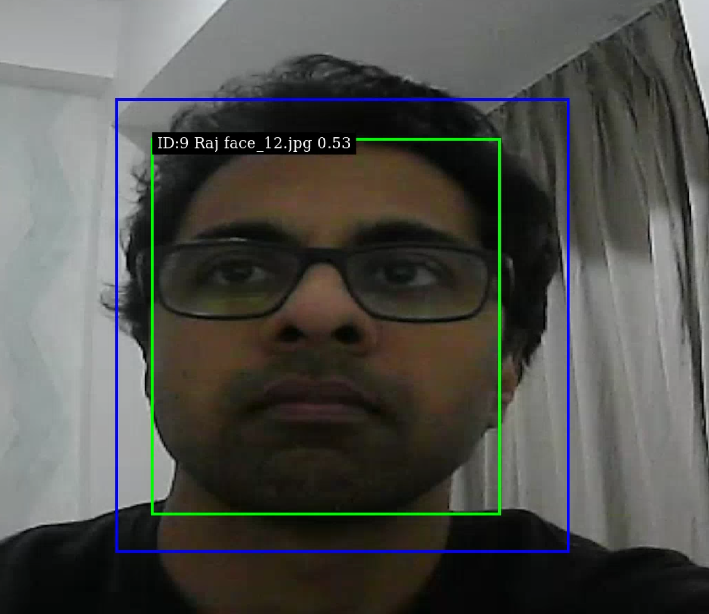
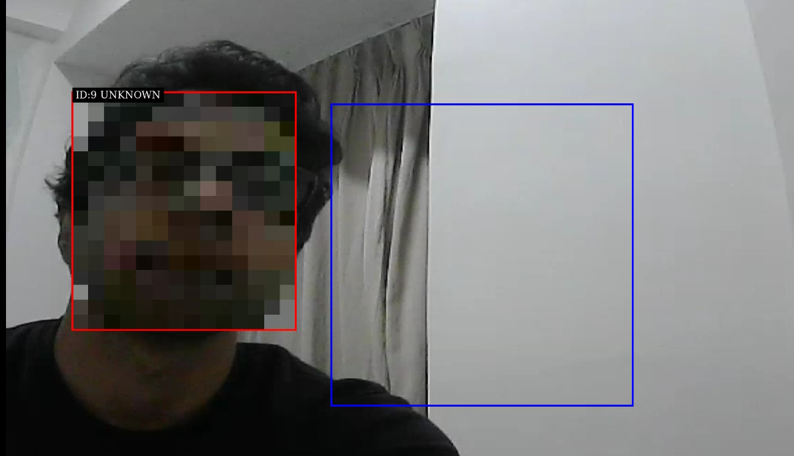

# Jetson Face Recognition
Real-time face detection, recognition, and anonymization pipeline with NVIDIA DeepStream on Jetson devices.

## Requirements
* NVIDIA DeepStream SDK (tested with 7.x)
* CUDA-enabled GPU
* GStreamer 1.0+

## Dependency
```
sudo apt update

sudo apt install -y \
    libgstrtspserver-1.0-dev \
    libyaml-cpp-dev \
    libcjson-dev

mkdir -p third_party
wget https://github.com/microsoft/onnxruntime/releases/download/v1.23.0/onnxruntime-linux-aarch64-1.23.0.tgz
mv onnxruntime-linux-aarch64-1.23.0.tgz third_party/
tar -xzf third_party/onnxruntime-linux-aarch64-1.23.0.tgz -C third_party/
```

## Models

You can download the models from https://drive.google.com/drive/folders/1V0CWzv83ZxOBluAwNQ7wo39BaOAmrMez

## Generate Face Embeddings

Face embeddings are generated offline from a dataset of cropped face images using the ArcFace model.
Each subdirectory inside the dataset folder represents a unique identity, and every image inside that folder will be converted into a 512-dimensional face embedding.

Dataset structure:
```
dataset/
├── John/
│   ├── 1.jpg
│   └── 2.jpg
└── Alice/
    ├── a.jpg
    └── b.jpg
```

Run:
```
./scripts/generate_embeddings.sh \
    dataset \
    models/arcface/arcface.onnx \
    embeddings
```
Arguments:
dataset → input dataset directory
models/arcface/arcface.onnx → ArcFace ONNX model
embeddings → output directory for generated embeddings and metadata

Generated files:
```
embeddings/
├── embeddings.bin
└── metadata.json
```
embeddings.bin → raw binary float32 embeddings stored sequentially
metadata.json → metadata for dataset and faces

Example metadata:
```
{
  "version": 1,
  "embedding_size": 512,
  "dtype": "float32",
  "normalized": true,
  "count": 1,
  "faces": [
    {
      "id": 1,
      "name": "John",
      "image": "1.jpg"
    }
  ]
}
```

## Configuration

Pipeline settings are configured through config/config.yml.

## Build
```
sudo make
```

## Run
Start the rtsp input stream and then run
```
./scripts/run.sh
```

## Viewing the stream
```
./scripts/view_rtsp_result.sh
```

## Demo


